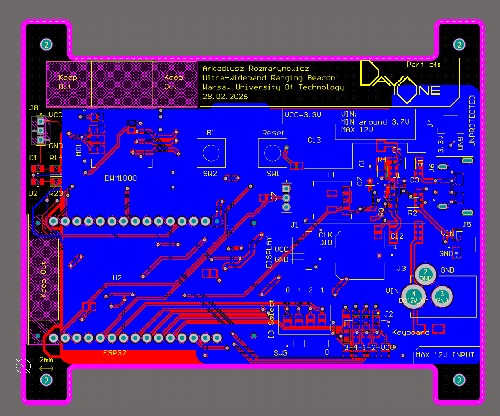
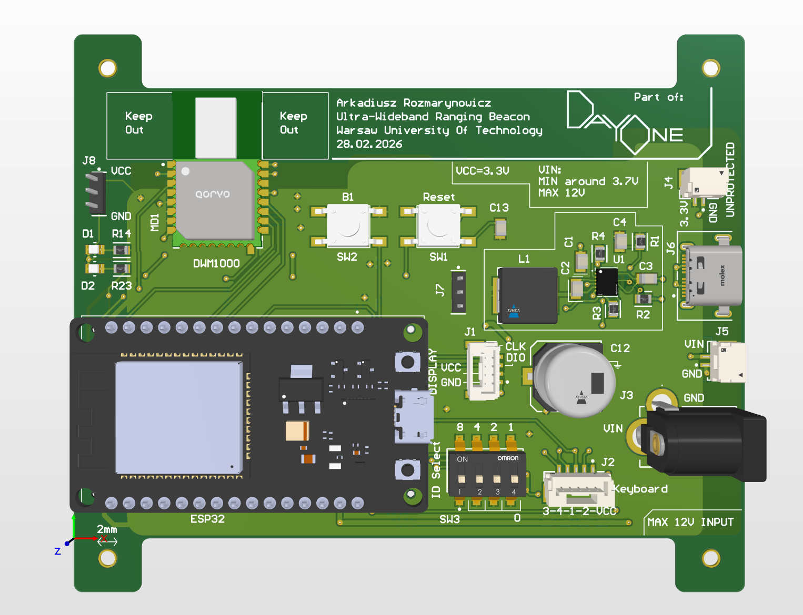
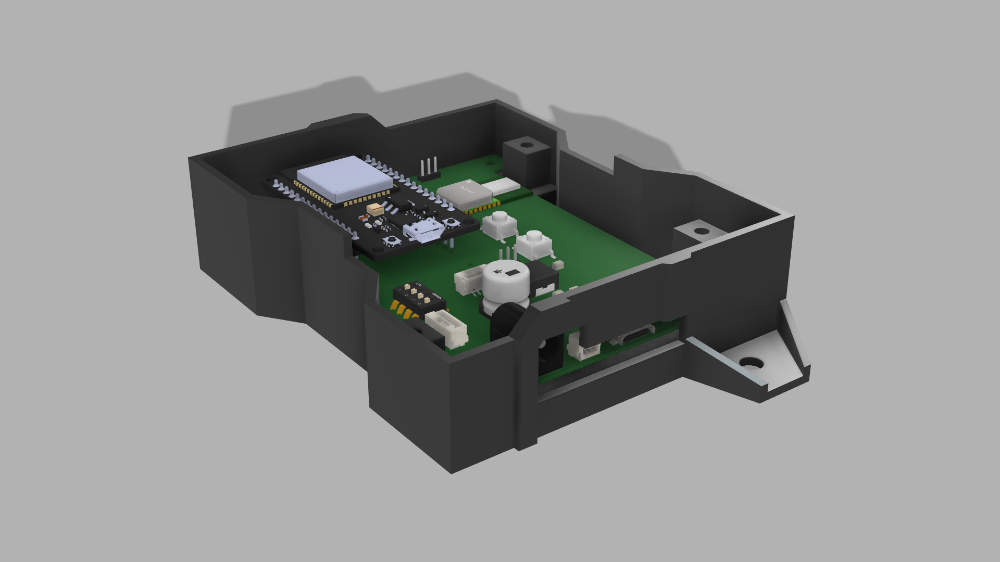

# UWB Positioning System - hardware
This folder contains files associated with hardware of the UWB Positioning System.

## Table of contents
* [General info](#general-info)
* [Project structure](#project-structure)
* [Software used](#software-used)
* [Setup](#setup)
* [Main components](#main-components)
* [Visualization](#visualization)

## General info
- Design of a PCB for an UWB anchor, including:
    - overcurrent, reverse voltage, ESD protection
    - on-board buck converter
    - bistable switches for manual anchor ID selection
    - connectors for external 7-segment display and a simple keyboard
- Design of a 3D-printed casing for the PCB

## Project structure
- The [Electronics](/Hardware/Electronics/) folder contains the entire Altium project, along with libraries, documents and gerber files.
- The [Mechanics](/Hardware/Mechanics/) folder contains the .step 3D files of the casing, and the PCB.

### Note
The 3D elements were designed with the Autodesk Fusion software, which stores all the project files in the cloud, hence only the final .step files are avaiable.

## Setup
Please refer to the [UWB_Beacon_Design_Documentation.pdf](/Hardware/Electronics/Documents/Design_Documentations/UWB_Beacon_Design_Documentation.pdf) for relevant schematics.

## Software used
- Used Altium Designer for PCB design.
- Used Autodesl Fusion for 3D design.

## Main components
Used the ESP32 microcontroller with the DWM1000 UWB module.

## Visualization
Images of the PCB and the casing are shown below.

