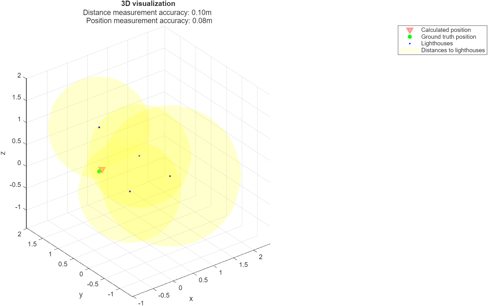

# UWB Positioning System
An indoor positioning system based on the Ultra-Wideband technology. It allows centimeter-accurate positioning of a moving tag, without relying on a GPS signal. Specifically designed for UAVs.

Implemented software, hardware, and simulation.

Author: Arkadiusz Rozmarynowicz.

## Table of contents
* [General information](#general-information)
* [Effectiveness](#effectiveness)
* [Technologies](#technologies)
* [Project structure](#project-structure)
* [Setup](#setup)
* [Note on collaborators](#note-on-collaborators)
* [Naming convention](#naming-convention)
* [Roadmap](#roadmap)
* [Future](#future)

## General information
- A communication system consisting of a moving tag and at least four ranging anchors.
- The tag and anchors are based on a DWM1000 ranging module and an ESP32.
- The anchors automatically determine their relative position on start-up.
- Implemented an algorithm for least square error estimation of the 3D coordinates, based on uncertain distance measurements.
- Designed and built a custom PCB with a 3D printed casing.
- Simulated and visualized the process in MATLAB.

----

 
<em>Figure 1: 3D view of the PCB.</em>

 
<em>Figure 2: 3D view of the casing.</em>

 
<em>Figure 3: Output visualization of one of the simulations.</em>

## Effectiveness
The system allows for positioning a slow-moving tag with an accuracy better than 25 centimeters.

## Technologies
Programming languages:
- C
- C++
- MATLAB

Communication protocols:
- UWB
- ESP-NOW
- SPI
- UART
- I2C

Tools used:
- PlatformIO
- STM32 Cube IDE
- Altium Designer
- Autodesk Fusion

## Project structure
The project has been split into three parts: software, hardware, and simulation.

- [Software](/Software/) consists of code for the tag and anchors.
- [Hardware](/Hardware/) consists of a PCB project and 3D-printed casing files.
- [Simulation](/Simulations/) consists of MATLAB code that allows for testing and visualizing different setups.

## Setup
To run the project, please first refer to the details in the [Hardware](/Hardware/) folder, and then follow the instructions in the [Software](/Software/) folder.

## Note on collaborators
The majority of commits come from "RocketEquation" and "arozmary" accounts, both of which belong to me.

## Naming convention
- The anchors are also referred to as "lighthouses".
- The tag is also referred to as an "observer".
- The module that reads data from the tag is also referred to as a "sailor".

## Roadmap
- [x] Distance measurements among the anchors
- [x] Automatic 3D estimation of each anchor relative to the others
- [x] 3D position estimation of the tag
    - [x] Least squares method
    - [ ] Weighted least squares method
- [x] PCB and 3D-printed casing
- [x] Test of the setup on a slowly moving tag
- [ ] Integration with an UAV

## Future
The project will play an important role in the development of my Bachelor's project: "Design and implementation of a quadrotor with a localization algorithm based on Ultra-Wideband beacons", which you can follow through this [repository](https://github.com/A-Rozmarynowicz/Portfolio_Quadcopter).