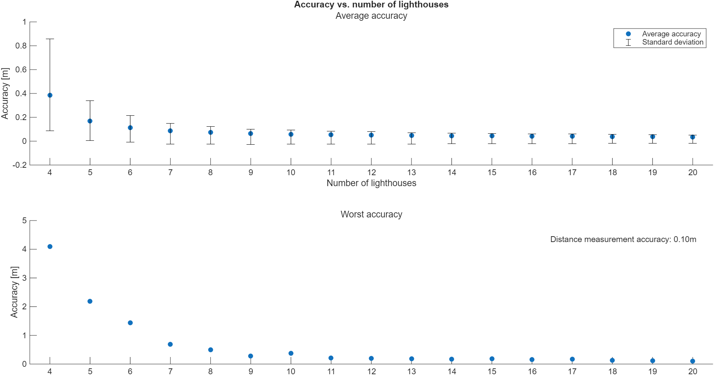
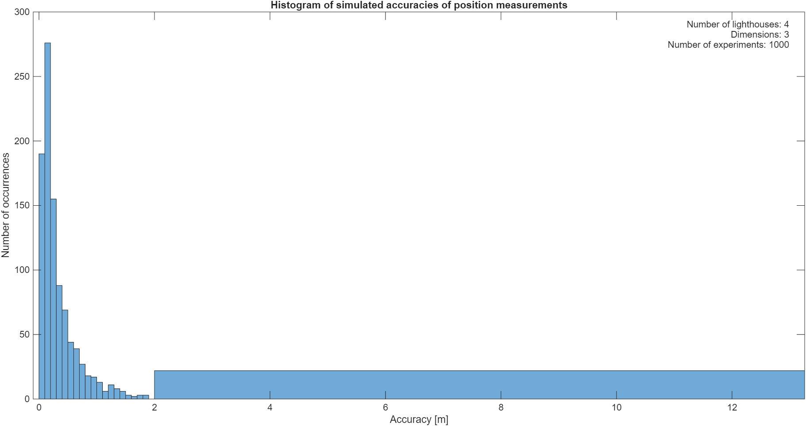
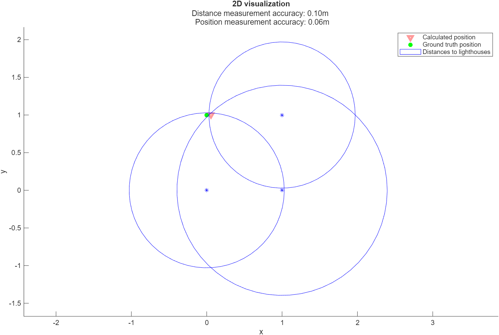

# Simulations
This subproject contains simulation resources for the UWB positioning system.

## Table of contents

## General information
- Simulations allow analysis of the positioning system in different setups
- 2D and 3D visualizations help understand the effectiveness of the process

## Example
In the following example, the default setup of the positioning system has been simulated, that is:
- single distance measurement accuracy is set to 0.10 meters
- lighthouses are placed no more than 5 meters from the origin
- lighthouses are placed no less than 0.5 meters from each other

### Accuracy vs. number of lighthouses
Below is a plot showing how average and worst-case accuracies change with number of active lighthouses:

We see that the effectiveness improves with more and more anchors. Five anchors seems as an optimal choice, in the sense that it provides good accuracy with fewer hardware elements.

### Accuracy distribution
Below is a histogram that shows what kind of position accuracy distribution can we expect, when four lighthouses are placed randomly (while still meeting requirements from the [Example](#example) section).

Numerical data:
- Average accuracy: 0.37m
- Standard deviation: 0.47m
- Most common accuracy interval: [0.10m, 0.20m]
- Worst accuracy: 5.10m

We conclude that the overall accuracy distribution is satisfactory. Poor position estimates occur infrequently.

### Visualizations
Here, the 2D and 3D visualizations are presented.

